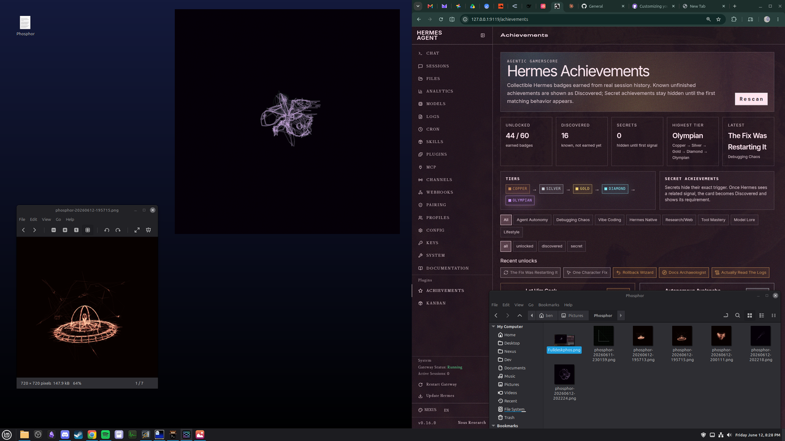

# Phosphor

<p align="center">
  <br>
  <em>A software XY oscilloscope for everything your PC plays.</em>
</p>

<p align="center">
  <a href="LICENSE"></a>
  <a href="https://github.com/RamenFast/phosphor/releases/latest"></a>
  
</p>

Phosphor watches "oscilloscope music" (Jerobeam Fenderson et al.) draw its
hidden pictures, and makes any system audio look good. In XY mode the left
channel moves the beam horizontally and the right channel moves it
vertically; scope music is composed so this traces actual drawings. Beam
brightness falls as the beam moves faster and the phosphor decays in two
layers (a blue-white flash where the beam lands, a colored glow that
lingers) — P7 phosphor physics, the details that make it look like the real
instrument.

> The animation above is a real Phosphor capture, exported straight from the
> app's own clip recorder.

## Drawn by sound

A few real captures, straight from Phosphor's snapshot button — each shape is
just a stereo audio file, traced live by the beam:

<p align="center">
  
  
  
</p>

## In use

The **full window** — headerbar transport, source picker, and the slider rail
down the side — running on a normal Linux desktop:

<p align="center">
  
</p>

And the **mini player**: a borderless, always-on-top square you tuck into a
corner while you work. Snapshots (`S`) drop into `~/Pictures/Phosphor` and
browse like any other folder.

<p align="center">
  
</p>

<p align="center"><sub><em>“Made with Claude Fable 5 — finished the last prompt before the feds took it down. Amazing model…”</em> — Ben<br>
Shipped to GitHub by Claude&nbsp;Opus&nbsp;4.8, the day Fable&nbsp;5 went dark (12 June 2026).</sub></p>

## Install

**Debian / Ubuntu / Linux Mint — prebuilt package**

Download the `.deb` from the [latest release](https://github.com/RamenFast/phosphor/releases/latest), then:

```bash
sudo apt install ./phosphor_2.5.0_all.deb
```

That installs the **Phosphor** launcher (applications menu + desktop icon)
and pulls in the dependencies below automatically.

**From source**

```bash
git clone https://github.com/RamenFast/phosphor.git
cd phosphor
python3 phosphor.py
```

Dependencies, all in the stock Mint / Ubuntu repositories:

```bash
sudo apt install python3-gi python3-gi-cairo gir1.2-gtk-3.0 \
                 pulseaudio-utils ffmpeg python3-numpy
```

- **PyGObject + GTK 3** — the application and its UI
- **`parec` / `pacat`** (pulseaudio-utils) — audio capture and playback,
  over PulseAudio or PipeWire
- **`ffmpeg`** — audio-file decoding and clip (mp4) export
- **`numpy`** *(optional)* — vectorizes the signal path (~7× faster,
  comfortably feeding high-refresh monitors); a pure-python fallback keeps
  working without it

The GPU renderer binds OpenGL through GTK's own libepoxy with ctypes — no
PyOpenGL needed. Phosphor targets Linux desktops (X11 or Wayland) running
PipeWire or PulseAudio.

**Build the package yourself**

```bash
packaging/build-deb.sh     # -> packaging/dist/phosphor_<version>_all.deb
```

## What to scope

The source picker offers three kinds of target:
- **APP** — one playing application (game audio without the music player,
  or vice versa); these come and go, the refresh button re-scans
- **OUT** — everything a given output plays (default: your default output)
- **IN** — microphones (hum into the Q2U for live Lissajous figures)

Or skip capture entirely: **open an audio file** (`O`, the folder button,
or the right-click menu) and Phosphor decodes it with ffmpeg, plays it out
loud, and scopes it directly — no separate player needed. Opening a file
discovers every track in its folder: transport buttons (⏮ ⏯ ⏭) and a seek
slider with an elapsed/total readout appear in the title bar, tracks
auto-advance, and pause freezes decode and playback in place. A
speaker/mic/app icon beside the source picker shows what kind of target
is selected.

## Compose (draw your own oscilloscope music)

The scope, run in reverse. Hit the ✏ pencil (or `D`), draw a shape on the
screen, release — Phosphor resamples your path into a closed audio loop
traversed at constant speed (left channel = X, right channel = Y), plays
it out loud, and the scope draws it back. Draw a mushroom, hear the
mushroom.

- **scroll** retunes the loop frequency (20–400 Hz): same shape, new pitch
- draw again to replace the shape; `Esc` or the pencil exits
- right-click → **Export drawing as WAV** writes 10 s to
  `~/Music/Phosphor/` — that file draws your shape on *any* XY
  oscilloscope (or in Phosphor itself, or sent to a friend)
- snapshots (`S`) and clips (`C`) work while a loop plays, so you can
  keep a picture or a video of your drawing drawing itself

App targets are remembered **by application name**, not stream number —
when Chrome finishes a song its stream dies, and Phosphor now waits for
that same app to play again and re-grabs it automatically (up to 3 min)
instead of dumping you onto another source.

## Modes

| Mode | What it's for |
| --- | --- |
| XY (scope art) | Oscilloscope music. The real deal. |
| XY · goniometer | Ordinary songs: raw XY collapses stereo music into a diagonal line; rotated 45° the mono energy stands upright and stereo width blooms sideways. |
| XY · dots | The same XY field as discrete sample dots, like a vectorscope's dot display — shows where the beam *dwells*. |
| Waveform | Dual trace with rising-edge triggering so pitched sounds hold still. |
| Spectrum | Log-frequency bars, fast attack / phosphor fall. |
| Spectrum · radial | The same analysis swept around a circle, bass at twelve o'clock. |

## Controls

- **⏻ Live** — capture on/off, with the status readout right beside it.
  Off = stream closed, render loop stopped, ~0% CPU.
- **Title bar** — open file, mini view, pin-above (hideable in settings),
  and the settings gear, sysmon-style.
- **📷 / ⏺** — snapshot to `~/Pictures/Phosphor`, save the last 10 s as
  mp4 *with sound* to `~/Videos/Phosphor`. Both re-render the captured
  audio offline, so exports look exactly like the screen did.
- **Sliders** — Gain / Glow / Beam, each with an editable percent box:
  click and type an exact value. Scroll the scope to zoom gain; the
  graticule grows and shrinks with it, octave-stepped like a volts/div
  switch. Or flip on **Auto gain** (settings or right-click) and the trace
  autosizes to the screen: gain follows the signal's peak — instant attack
  when something would clip off-screen, slow glide as it fades.
- **⚙ settings** — renderer (GPU/CPU), GPU quality (2×/3× supersampling)
  and CPU resolution selectors, **Scope detail** (feed sample rate:
  48/96/192 kHz — higher rates resample with proper sinc reconstruction,
  so the scope traces the true curves *between* samples and fine scope-art
  detail stops washing out), beam Focus (sharper beams keep dense
  scope-art scenes from washing out), themes (P7 Green, Amber, Ice Blue,
  White, Vaporwave, Red Phosphor, Ultraviolet, Solar Gold, Cyan Tube,
  Custom), grid, AMOLED scope background, UI style (System / Dark / Light
  / AMOLED pink-on-black chrome with yellow selected states), FPS overlay
  (now also shows python ms per frame — if that's tiny and fps is below
  refresh, the GPU or compositor is the limit), and a Max FPS cap (leave
  at **0** to follow the monitor's refresh rate; setting it equal to the
  refresh rate makes the cap race vsync and drop frames).

  The GPU beam uses an analytic erf line integral (the woscope trick):
  consecutive segments join without double-depositing energy, which is
  what keeps complex scenes like *72 Pantera* from blooming into fuzz.
  Compositing happens in linear light with output dithering: faint trail
  detail is no longer crushed by display gamma, and dark glow falloff has
  no banding rings.
- **Mini** — borderless always-on-top square. Drag to move, drag the
  bottom-right corner or Ctrl+scroll to resize (square stays square, up
  to 1000 px), right-click for the full menu (modes, themes, grid, pin,
  sizes up to Extra large…), double-click to restore. Window positions,
  sizes, and all settings are remembered in
  `~/.config/phosphor/settings.json`, including whether you quit in mini.
- **Keys** — `Space` capture · `O` open file · `D` compose (draw) · `M`
  mini · `F11` fullscreen scope (chrome-less; also the path to the
  monitor's full refresh rate, since compositors unredirect fullscreen
  windows) · `S` snapshot · `C` clip · `P` pin · `G` grid · `F` fps
  · scroll = gain (pitch while composing) · `Q`/`Esc` quit.

Trails grade continuously in time: each sample's deposit is pre-decayed
by its age within the frame, so slowly drifting sweeps blend the way real
phosphor does instead of leaving stepped duplicate lines.

## Resource behavior (measured)

| State | CPU |
| --- | --- |
| Capture off | ~0% (parec killed, render loop removed, PipeWire suspends the source) |
| Armed but silent | <1% (silence detected by content; monitors deliver zeros, so an empty-buffer check doesn't work) |
| Live, GPU renderer | ~10% of one core |
| Live, CPU renderer | ~25–35% of one core (signal math + phosphor decay now run on a worker thread, so the UI stays smooth and slow frames drop instead of queueing) |

## Things to try

- Jerobeam Fenderson — *How To Draw Mushrooms*; whole albums at
  https://oscilloscopemusic.com
- Put on any normal song in **XY · goniometer** and watch the stereo image dance.

## Future

See [FUTURE.md](FUTURE.md) — compose mode shipped in 2.4; next candidates:
SVG import for compose, GL bloom, multi-app mixing, a Cinnamon applet.

## License

GPL-3.0-or-later — see [LICENSE](LICENSE). Free as in phosphorescence:
use it, read it, change it, share it; derivatives stay free too.
