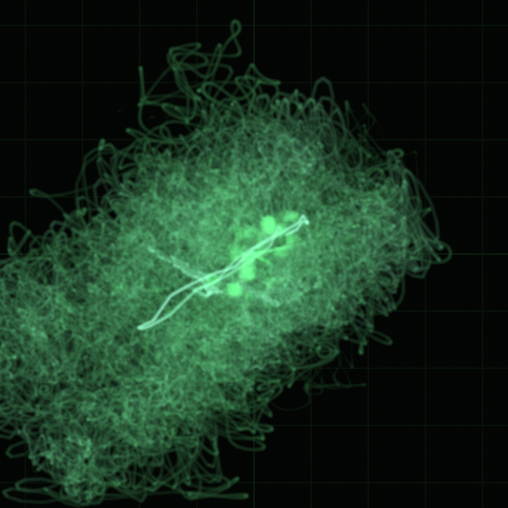
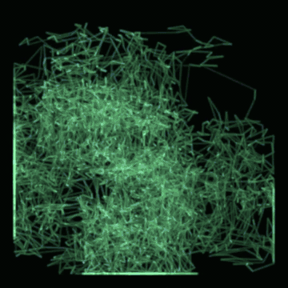

# Phosphor

<p align="center">
  <br>
  <em>A GPU oscilloscope for everything your PC plays.</em>
</p>

<p align="center">
  <a href="LICENSE"></a>
  <a href="https://github.com/RamenFast/phosphor/releases/latest"></a>
  
  
</p>

In XY mode the left channel moves the beam horizontally, the right channel
vertically — so "oscilloscope music" (Jerobeam Fenderson et al.) draws its
hidden pictures on screen, and any stereo track has a shape worth watching.
The beam behaves like a real P7 CRT: brightness falls as it moves faster,
and the phosphor decays in two layers — a blue-white flash where it lands,
a colored glow that lingers.

> The animation above is a real Phosphor capture, exported straight from
> the app's own clip recorder.

**v4 is the full-Rust instrument**: one engine, `egui + wgpu` chrome,
native PipeWire capture, zero Python, zero fallback paths. It holds the
monitor's refresh rate with the GPU nearly idle (3,400 fps uncapped where
v3 ceilinged at 163), and everything it renders offline is byte-exact
with what you saw live.

## v3 → v4, honestly

| | v3.5 (Python/GTK) | v4.0 (Rust) |
|---|---|---|
| Live ceiling, 2560×1440 | 163 fps (GTK frame clock) | monitor-locked; 3,400 fps uncapped |
| CPU renderer on noise | 3 fps | ~26 fps engine, on its own thread — the UI stays at panel rate |
| Signal engines | two (Python + Rust core, kept in parity) | **one** |
| Audio | pactl/parec subprocesses | native PipeWire (capture, playback, gapless, vacuum) |
| Mix several apps into one beam | — | ✅ the light-streams panel |
| Control another player (Spotify…) | watched titles only | **watches and drives** — the transport controls whatever the beam scopes |
| Track notifications with album art | — | ✅ systemwide |
| Agent surface | none | `probe · ctl · tap · feed · kit · schema` over a control socket |
| Single instance | GTK gave it for free | ✅ second launch focuses the first, files forward |
| Chrome | 7 GTK styles | 11 token-driven looks, IBM Plex + JetBrains Mono type |
| Studio scene compiler | ✅ v3.5 | returns in Rust after 4.0 ([#1](https://github.com/RamenFast/phosphor/issues/1)) |
| Render-ahead precompute | ✅ | retired by design — the GPU reconstructs in realtime ([#2](https://github.com/RamenFast/phosphor/issues/2)) |

## Drawn by sound

Each shape below is just a stereo audio file, traced by the beam — saved
with the snapshot button:

<p align="center">
  
  
  
  
</p>

## In use

<p align="center">
  <br>
  <sub>v4.0 in Blossom Dark — Attack Vector mid-cube, auto-gain breathing, every readout in real units.</sub>
</p>

<p align="center">
  <br>
  <sub>Scoping Spotify? The transport <b>drives Spotify</b> — prev/pause/next straight over MPRIS.</sub>
</p>

## Eleven ways to see sound

<p align="center">
  <br>
  <sub>One track, eleven instruments: XY scope art · goniometer · swirl · dots · waveform · ring · spectrum · radial · tunnel — and two true-3D views, the Takens attractor and the time helix, both orbitable by mouse.</sub>
</p>

## Twelve rooms to see it in

<p align="center">
  <br>
  <sub>Blossom Dark (default) · Stonework 95 · AMOLED · Paper · CRT Amber — plus Blossom, Light, Dark, Chromacore, Basalt, Afterglow (whose chrome remembers the beam color), and Fable — the storyteller's sea-green room the model that built v4 left behind. Different rooms, not different paint: the picker shows swatches so you can tell.</sub>
</p>

<p align="center">
  <br>
  <sub><b>Glass + mini:</b> an always-on-top square of pure beam, the desktop showing through. (Here: drawing over the very terminal that shipped this release.)</sub>
</p>

## The beam learns color

<p align="center">
  <br>
  <sub><b>The color cycle, live:</b> up to three phosphors crossfading on your timer — or one color step per song. Rendered by <code>phosphor render</code> itself: exports carry the cycle exactly as the screen did.</sub>
</p>

## What it does

- **Scope anything** — whole outputs, one application, a microphone, or
  **several apps folded into one beam** (the light-streams panel), all
  native PipeWire. Capture off costs ~0% CPU.
- **Play music in it** — gapless playlists, shuffle/repeat, seek, cover
  art, per-stream volume; full **MPRIS both ways** — media keys drive
  Phosphor, and when the beam scopes another player, **Phosphor's
  transport drives that player**.
- **Tell you what's playing** — a systemwide notification with the album
  art on every track change (yours or the scoped player's). Toggleable.
- **A real beam** — analytic Gaussian beam integral, linear-light
  compositing, two-layer P7 decay, octave graticule; GPU (wgpu) and
  SIMD-CPU renderers sharing one beam model, byte-compared in CI-grade
  tests. The CPU raster runs on its own worker thread.
- **Beam color cycle** (4.1) — the Custom phosphor takes up to
  **three colors** that crossfade on your timer (one stays static, two
  ping-pong, three walk the ring) — or, since 4.2, advance **one color
  per song** (yours or the scoped player's) and rest in between.
  Exports re-live the exact colors; chrome that follows the beam
  follows the cycle. Sub-second timer transitions sit behind an
  explicit photosensitivity confirmation.
- **The nerd HUD** — F cycles fps → full panel: cpu/gpu frame times
  (real GPU timestamps), p99, dropped frames, segments/s, resolution.
- **Compose mode** — press D, draw a shape, hear it immediately; export
  the drawing as a WAV any oscilloscope on earth can play.
- **Signal postcards** — export a track's trace as `.phos` (plays at
  your detail rate with "trace by you" fading in) or send a `.phoskit`:
  a transform chain (rotate, widen, ring-mod, delay…) that bends into
  whatever the receiver is listening to, live. Kit editor included;
  three starter kits in the box.
- **Vacuum mode** — sound as light only: the track (or a whole app)
  plays full-tilt into a silent sink and arrives only on screen. The
  restore path is sacred — sound always comes back, even after a crash.
- **Exports** — snapshots and 10-second clips with sound, re-rendered
  offline so they look exactly like the screen did; plus
  `phosphor render song.flac out.mp4`, a headless full-track render.
- **An agent surface** — see below; a 7B model can drive the scope.

## Install

Grab the [latest release](https://github.com/RamenFast/phosphor/releases/latest).

**Debian · Ubuntu · Mint (.deb)** — or just double-click it:

```bash
sudo apt install ./phosphor_4.5.0_amd64.deb
```

**Fedora · openSUSE (.rpm)** *(built on Mint, `rpm --test`-verified — reports welcome)*:

```bash
sudo dnf install ./phosphor-4.5.0-1.x86_64.rpm
```

**From source** (any Linux; Rust 1.96+):

```bash
git clone https://github.com/RamenFast/phosphor.git && cd phosphor
# build deps — Debian/Ubuntu/Mint:
sudo apt install build-essential libpipewire-0.3-dev scdoc
# Fedora:  sudo dnf install gcc pipewire-devel scdoc
cargo build --release
sudo install -m755 target/release/phosphor /usr/local/bin/phosphor
```

Runtime needs: PipeWire (any modern distro), Vulkan drivers for the GPU
renderer (`libvulkan1` — the CPU renderer works without), `ffmpeg` for
mp4 clips and `.phos`-from-anything renders.

**Verify it breathes:**

```bash
phosphor --version   # phosphor 4.5.0 (v4)
phosphor             # the scope; second launches focus this one
```

## The panel applet (Cinnamon only)

A live vectorscope in your Cinnamon panel, fed by `phosphor feed` —
zero engine code of its own. GNOME/KDE: the applet can't load there
(it's Cinnamon's applet API), but the main app runs everywhere.

```bash
applet/install.sh    # then add "Phosphor Scope" from Menu → Applets
```

Details: [applet/README.md](applet/README.md).

## For agents

Phosphor is drivable without pixels — one binary, JSON everywhere,
exit codes 0/2/3/4, every error carries a `fix`:

```bash
phosphor probe --json                    # live state in one shot
phosphor ctl mode xy45                   # drive the running scope
phosphor ctl target mix:app:a+app:b      # fold two apps into the beam
phosphor tap | jq .bbox                  # per-frame geometry stream
phosphor kit validate mykit.phoskit      # errors a 7B model can fix
phosphor schema                          # the whole machine-readable map
```

The full guide (patterns, gotchas, the feed protocol):
[docs/AGENTS.md](docs/AGENTS.md).

## Things to try

- Jerobeam Fenderson — *How To Draw Mushrooms*; whole albums at
  [oscilloscopemusic.com](https://oscilloscopemusic.com)
- Any normal song in **XY · goniometer** and watch the stereo image dance.
- Hit `D` and draw something. It plays.
- Scope Spotify, then press pause — *in Phosphor.*
- Load the **haunt** kit on a mono podcast and watch voices grow shapes.

The [manual](docs/MANUAL.md) covers everything in detail — there's a
copy inside the app too (the book icon, left of the gear).

## License & credits

GPL-3.0-or-later — see [LICENSE](LICENSE). Free as in phosphorescence:
use it, read it, change it, share it; derivatives stay free too.

Bundled type: IBM Plex Sans & JetBrains Mono (OFL).

<p align="center"><sub>Designed and built by Ben with <b>Claude</b> —
v1→v3 with Claude Fable 5 & Opus 4.8; v4.0, the full-Rust rewrite,
shipped in one long night with Fable 5, camera rolling.<br>
Signed, as always: <b>TURTLE VECTOR</b> 🐢⚡📼</sub></p>
