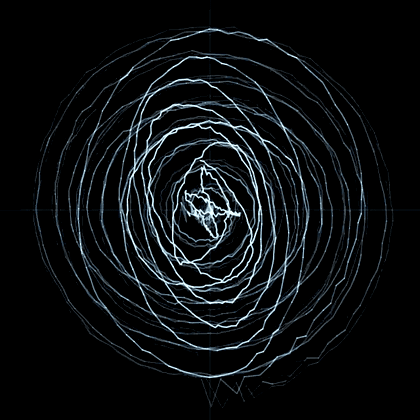
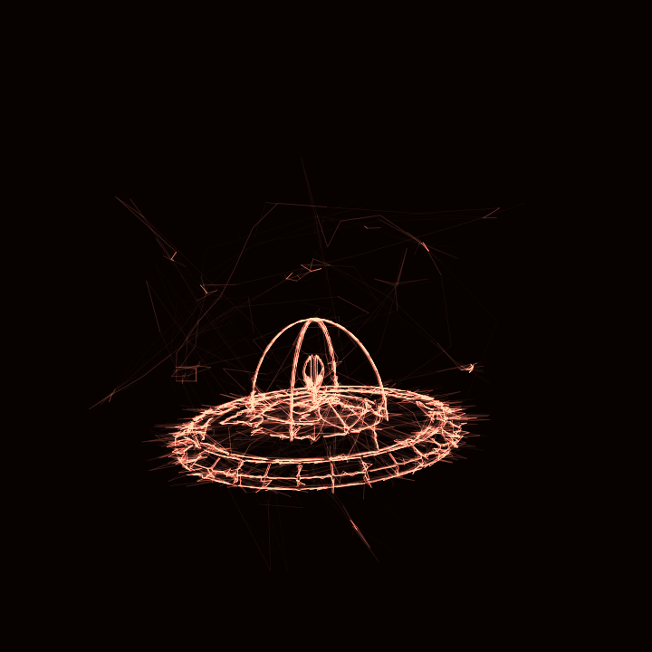
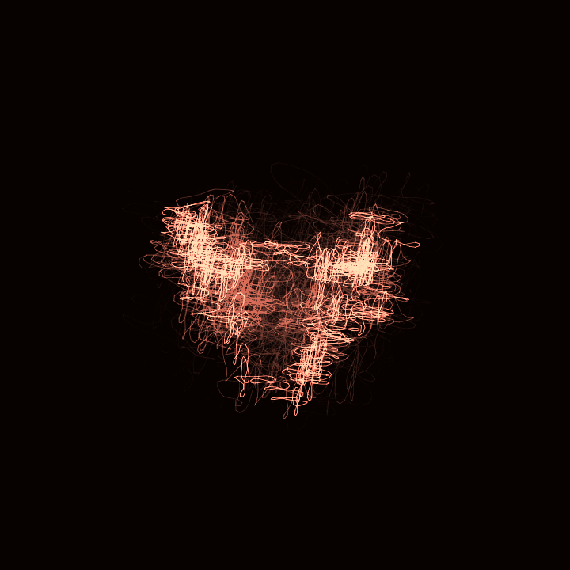
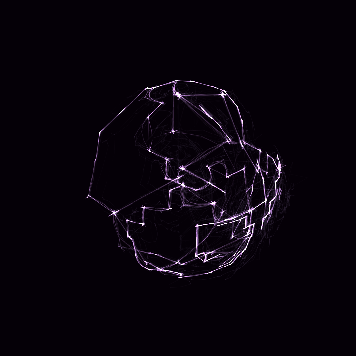
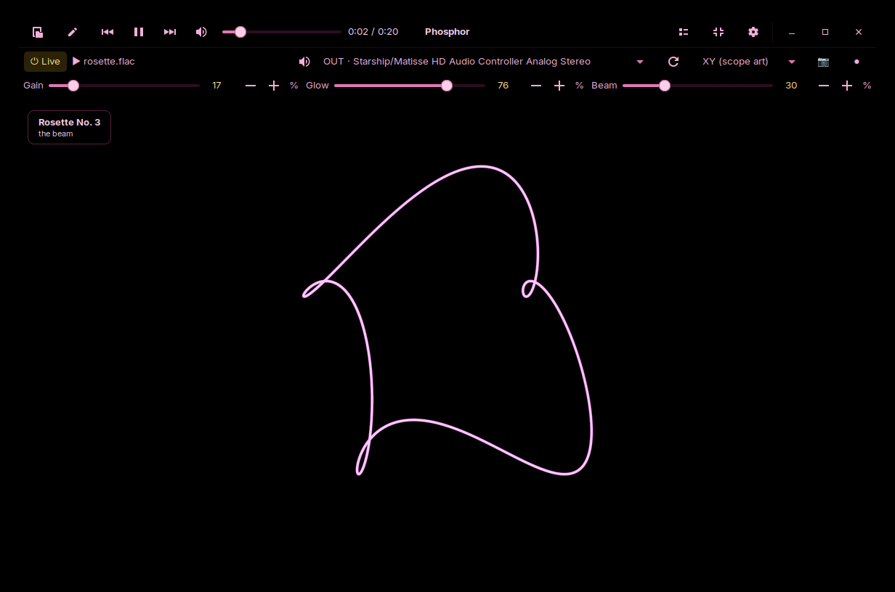
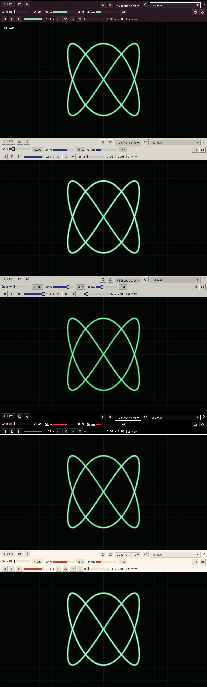
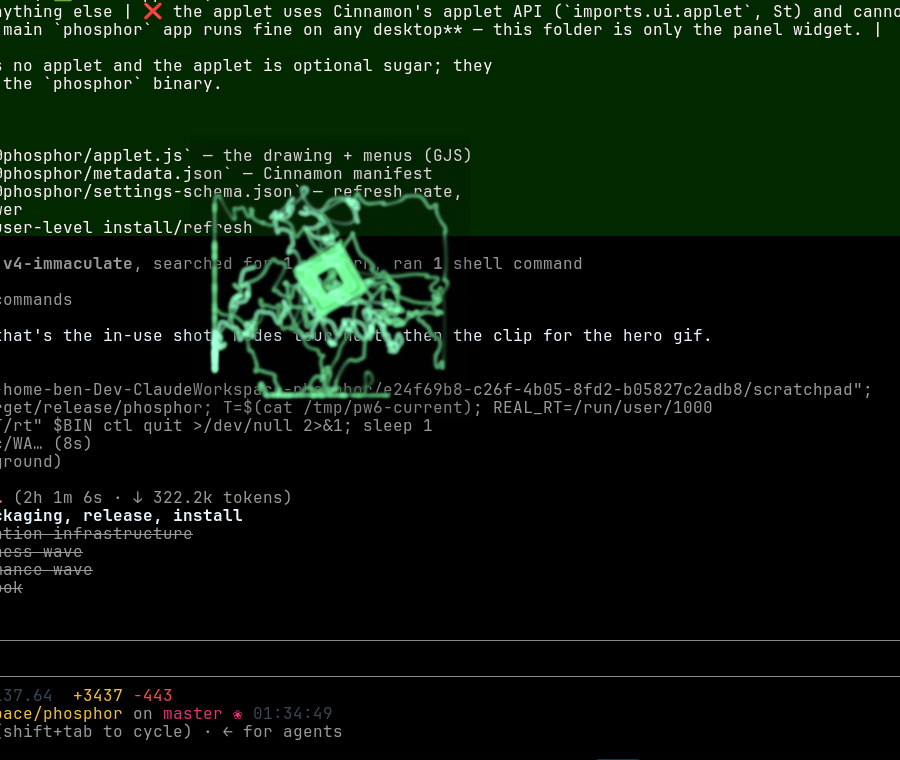
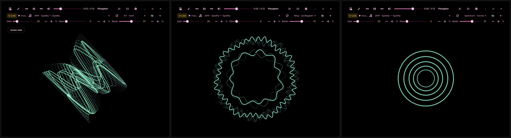

# Phosphor

<p align="center">
  <br>
  <em>A software XY oscilloscope for everything your PC plays.</em>
</p>

<p align="center">
  <a href="LICENSE"></a>
  <a href="https://github.com/RamenFast/phosphor/releases/latest"></a>
  
</p>

In XY mode the left channel moves the beam horizontally, the right channel
vertically — so "oscilloscope music" (Jerobeam Fenderson et al.) draws its
hidden pictures on screen, and any stereo track has a shape worth watching.
The beam behaves like a real P7 CRT: brightness falls as it moves faster,
and the phosphor decays in two layers — a blue-white flash where it lands,
a colored glow that lingers.

> The animation above is a real Phosphor capture, exported straight from
> the app's own clip recorder.

> **v4 status (July 2026):** Phosphor is now the full-Rust rewrite —
> egui + wgpu + native PipeWire, one engine, far past v3's frame
> ceiling. The Python v3 app is retired; `packaging/build-deb.sh`
> builds the compiled `.deb` (`4.0.0~wave3.1`). Screenshots and
> MANUAL.md still show v3 pending the wave-3 docs pass.
>
> **Not yet in v4 (honest ledger vs v3.5)** — each tracked as a
> GitHub issue:
> - **`phosphor-studio` scene compiler** (scenes → oscilloscope
>   audio) was retired with v3; it returns in Rust in wave 4.
> - **Render-ahead precompute** was deliberately not ported — the v4
>   engine reconstructs in realtime (GPU path); rationale + revisit
>   criteria live in PARITY.md.
> - **Agent CLI** (`probe`/`tap`/`ctl`/`kit validate|inspect`)
>   are exit-2 stubs until the rest of wave 3; `feed` shipped in
>   wave 3.1 (the engine-free applet draws from it).
> - **Multi-app mixing** exists in the audio engine but has no UI yet.
> - **MANUAL.md** describes v3 until the wave-3 docs rewrite; v4
>   ships a `phosphor(1)` manpage meanwhile.

## Drawn by sound

Each shape below is just a stereo audio file, traced live by the beam —
saved with the snapshot button:

<p align="center">
  
  
  
</p>

## In use

<p align="center">
  <br>
  <sub>v3.1 on a Cinnamon desktop — AMOLED pink chrome, the built-in player mid-track, track info fading in.</sub>
</p>

<p align="center"><sub><em>“Made with Claude Fable 5 — finished the last prompt before the feds took it down. Amazing model…”</em> — Ben<br>
Shipped to GitHub by Claude&nbsp;Opus&nbsp;4.8, the day Fable&nbsp;5 went dark (12 June 2026).</sub></p>

## Seven looks

<p align="center">
  <br>
  <sub>Same scope, different metal: AMOLED pink · Bloom neon · Stonework 95 · Stonework bloom · Aero glass (genuinely translucent under a compositor) · Ice Blue ❄ — plus your system theme.</sub>
</p>

<p align="center">
  <br>
  <sub>And with <b>Glass scope</b> on, the scope becomes a window to your desktop — the beam draws over whatever is behind it while the controls keep their solid chrome. Works in every style; pairs dangerously well with the mini view.</sub>
</p>

## Eleven ways to see sound

<p align="center">
  <br>
  <sub>Three of the eleven: XY · swirl, Ring · oscillogram, Spectrum · tunnel. The others: XY scope art, goniometer, XY dots, waveform, spectrum, radial — and two true-3D views below.</sub>
</p>

### The third dimension

**3D · attractor** delay-embeds the signal — (x(t), x(t−τ), x(t−2τ)),
τ chasing a quarter period of the dominant pitch — so the music's
*attractor* appears: pure tones are tilted ellipses, chords weave tori,
voices grow organic knots. **3D · time helix** extrudes the XY figure
backwards into the past, newest audio floating near the eye. Drag to
orbit either one, scroll to dolly, arrows to nudge — and left alone,
the view slowly drifts on its own. Depth dims the beam like far
phosphor. Try one over a fully-clear **Glass scope**.

## What it does

- **Scope anything** — whole outputs, one application, or a microphone
  (PulseAudio/PipeWire); capture off costs ~0% CPU.
- **Play music in it** — a built-in player with folder playlists, a
  playlist panel with shuffle/repeat, drag-and-drop, seek, per-stream
  volume, artist/title fading in on track change, and full **MPRIS** both
  ways: media keys drive Phosphor, and songs changing in your browser or
  Spotify still show on the scope.
- **Eleven displays** — XY scope art, goniometer, a slowly revolving
  swirl, XY dots, triggered waveform, ring oscillogram, spectrum, radial
  spectrum, a breathing spectrum tunnel — and two true-3D views: the
  Takens attractor and the time helix, both orbitable by mouse.
- **Seven chrome styles** — AMOLED pink, Bloom neon, Stonework 95,
  Stonework · bloom, truly-translucent Aero glass, Ice Blue ❄, or your
  system theme.
- **A real beam** — analytic Gaussian beam integral on the GPU, linear-light
  compositing, two-layer phosphor decay, octave-stepped graticule.
- **A Rust core** — the samples→segments math runs native, and in-process
  sinc oversampling reconstructs up to **384 kHz of trace detail** from a
  48/96 kHz capture feed (Python fallbacks keep everything working
  without it).
- **Precompute** — render a track's scope stream to disk ahead of time and
  trace it synced to playback time: slow machines get perfect detail,
  nothing drops.
- **Compose mode** — draw a shape on the scope and it *becomes* audio: a
  loop that draws itself, exportable as WAV for any oscilloscope.
- **Signal postcards** — share the scope itself: export any track's trace
  as a `.phos` stream a friend can drop on their Phosphor (it plays, at
  *your* detail rate, with *"trace by you"* fading in), or send a
  `.phoskit` — a chain of signal-space transforms (rotate, widen,
  ring-mod, channel delay…) that bends into **whatever they're
  listening to**, live. A built-in kit editor composes chains against
  the running beam; three starter kits ship in the box.
- **Vacuum mode** — play without sound: the track (or a whole app, routed
  into a null sink) plays full-tilt into the void and arrives only as
  light. Sound can't cross a vacuum; a CRT is a vacuum tube. Scope a
  muted game, preview loud things at 3 am, watch a second player
  silently. The ⌀ toggle lives in the transport; *Vacuum this app* in
  the right-click menu. The restore path is sacred — streams always
  come back, even after a crash.
- **Exports** — snapshots and 10-second mp4 clips *with sound*, re-rendered
  offline so they look exactly like the screen did — plus
  `phosphor --render song.flac out.mp4`, a headless full-track render
  of any audio file or `.phos` postcard through the same pipeline.
- **Cinnamon panel applet** — a tiny live vectorscope in your panel, with
  its own themes, refresh rate, and CRT power switch.
- **phosphor-studio** — a scene compiler: plain-JSON documents
  (`{"shape": {"kind": "turtle"}, "animate": …}`) compile to stereo audio
  whose waveform *is* the picture, playable on any XY scope on earth.
  `render` / `validate` / `inspect` / `preview`, `--output json` for
  agents, deterministic builds pinned by golden tests, a manpage, and
  two starter scenes — the breathing dot, and the turtle.

The [manual](docs/MANUAL.md) covers all of it in detail.

## Install

**Debian / Ubuntu / Linux Mint — prebuilt package**

Download the `.deb` from the [latest release](https://github.com/RamenFast/phosphor/releases/latest), then:

```bash
sudo apt install ./phosphor_3.0.0_amd64.deb
```

(An `N: Download is performed unsandboxed…` note from apt is harmless —
install from `/tmp` to avoid it.)

**From source**

```bash
git clone https://github.com/RamenFast/phosphor.git
cd phosphor
python3 phosphor.py
```

Dependencies, all in the stock Debian / Mint / Ubuntu repositories:

```bash
sudo apt install python3-gi python3-gi-cairo gir1.2-gtk-3.0 \
                 pulseaudio-utils ffmpeg python3-numpy
```

Optional but worth it — the native signal core (any recent Rust):

```bash
cd core && cargo build --release
```

**Panel applet (Cinnamon)**

```bash
applet/install.sh   # then add "Phosphor Scope" from Menu -> Applets
```

## Things to try

- Jerobeam Fenderson — *How To Draw Mushrooms*; whole albums at
  https://oscilloscopemusic.com
- Any normal song in **XY · goniometer**, and watch the stereo image dance.
- Hit `D` and draw something. It plays.
- Load the **haunt** kit on a mono podcast and watch voices grow shapes.

## License

GPL-3.0-or-later — see [LICENSE](LICENSE). Free as in phosphorescence:
use it, read it, change it, share it; derivatives stay free too.
